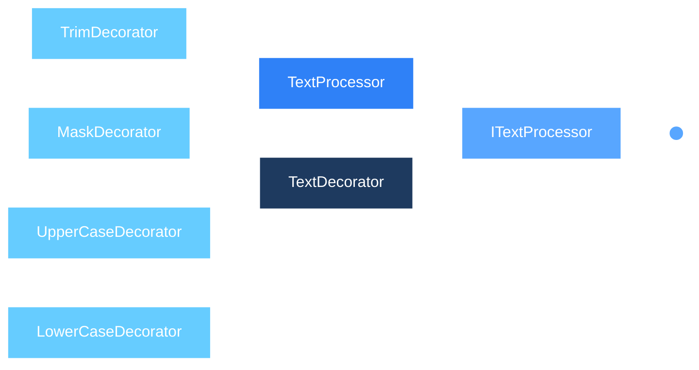

# Text Transformation Pipeline

Graded assignment for the course **CS5617 Software Engineering**.

## Problem Statement

### A17: Decorator - Text Transformation Pipeline

Compose transformations such as trimming, masking, and case conversion around a basic text processor.

The implementation must:

- Implement at least three decorators.
- Allow decorators to be composed in arbitrary orders.
- Demonstrate a multi-decorator pipeline through unit tests.

This project demonstrates the **Decorator Design Pattern** in C#.

---

## Design Overview

The **Decorator Pattern** is used to dynamically add responsibilities to an object without modifying its underlying implementation.

The design consists of:

- `ITextProcessor` - common interface for all text processors.
- `TextProcessor` - concrete component that returns the input unchanged.
- `TextDecorator` - abstract decorator that wraps another `ITextProcessor`.
- `TrimDecorator` - removes leading and trailing whitespace.
- `MaskDecorator` - replaces non-whitespace characters with `*`.
- `UpperCaseDecorator` - converts text to uppercase.
- `LowerCaseDecorator` - converts text to lowercase.

>[!Note] **Note**
Each decorator implements the same `ITextProcessor` interface. Therefore, a decorator can wrap either the basic processor or another decorator.

### Example 

To convert a stirng , let's say 
```text
X = "  sReEnAtH k11     "  to   Y = "SREENATH K11"
```

We can the use the decorator in the following order. That is we can compose the decorators to achieve the required result.


### Why the Decorator Pattern?

A straightforward alternative would be to create a large class containing every possible combination of transformations.This approach becomes difficult to maintain as the number of transformations increases.
The Decorator Pattern avoids this problem by keeping each transformation independent.

## Class diagram



## Test Summary

The test project contains 36 unit tests.

| Test Class                | Number of Tests |
| ------------------------- | --------------: |
| `TextProcessorBasicTests` |               4 |
| `LowerCaseDecoratorTests` |               6 |
| `MaskDecoratorTests`      |               6 |
| `TrimDecoratorTests`      |               6 |
| `UpperCaseDecoratorTests` |               6 |
| `PipelineTests`           |               9 |
| **Total**                 |          **37** |

>The test verify the working of each individual decorator and also the **Pipeline Test** verify the working of decorator decompsistions.

## Build and Test

#### To build the solution

**CLI**
```bash
dotnet build
```
**GUI**
```text
Click Build -> Build solution in the nav bar.
```
#### To run the test 

**CLI**
```bash
dotnet test
```
**GUI**
```text
Click Test -> Run all test in the nav bar.
```

