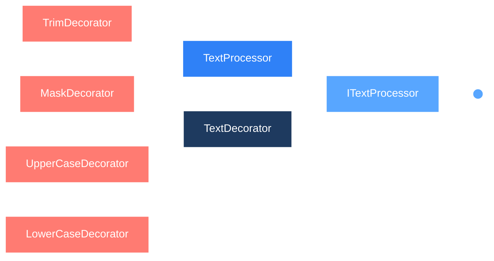

# Text Transformation Pipeline
Graded assignment for the course : CS5617 Software Engineering

## Class diagram

```mermaid
graph LR

    I["ITextProcessor"]
    T["TextProcessor"]
    D["TextDecorator"]

    TR["TrimDecorator"]
    M["MaskDecorator"]
    U["UpperCaseDecorator"]
    L["LowerCaseDecorator"]

    O(( ))

    T -.-> I
    D -.-> I
    I ---O

    TR --> D
    M --> D
    U --> D
    L --> D

    style I fill:#58A6FF,color:#fff,stroke:#fff
    style O fill:#58A6FF,color:#fff,stroke:#fff
    style T fill:#2F81F7,color:#fff,stroke:#fff
    style D fill:#1E3A5F,color:#fff,stroke:#fff
    style TR fill:#FF7B72,color:#fff,stroke:#fff
    style M fill:#FF7B72,color:#fff,stroke:#fff
    style U fill:#FF7B72,color:#fff,stroke:#fff
    style L fill:#FF7B72,color:#fff,stroke:#fff

    linkStyle default stroke:#ffffff

```